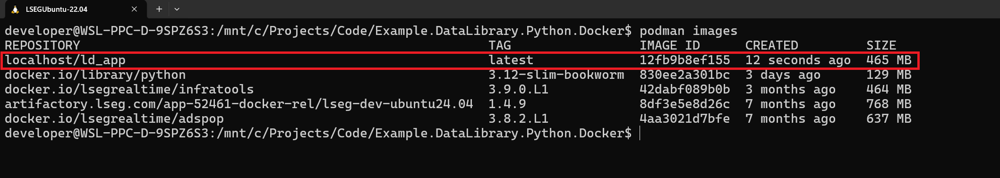
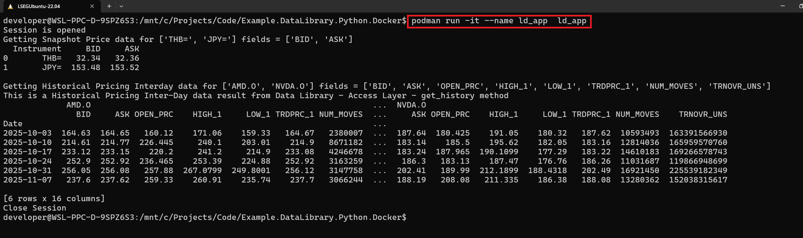
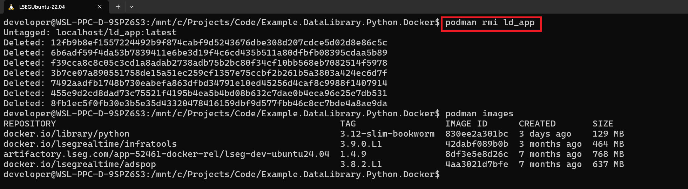
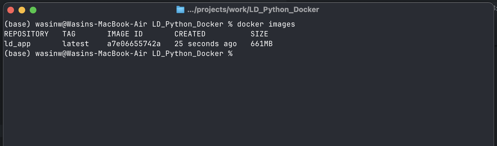
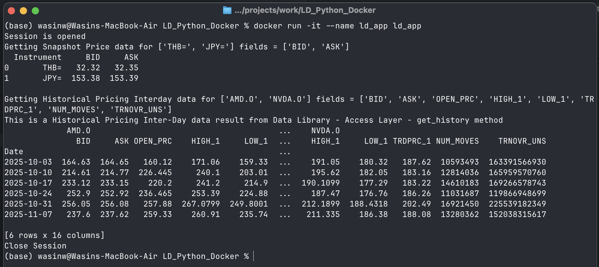

# How to Run Data Library for Python in Containerization tool

- Last update: November 2025
- Environment: Any with Python support 
- Compiler: Python
- Prerequisite: Delivery Platform (RDP) Access Credentials

## Overview

This project demonstrates how to run the [LSEG Data Library for Python](https://developers.lseg.com/en/api-catalog/lseg-data-platform/lseg-data-library-for-python) (aka Data Library version 2) inside a container. This means you can package the application and run it anywhere without worrying about installing Python or managing dependencies on your local machine.

**What you'll learn:**
- How to containerize a Python application that accesses LSEG financial data
- How to connect to LSEG's cloud platform (Platform Session) from within a container
- How to build and run containers using Docker or Podman

**Technology used:**
- Data Library for Python version 2.1.1
- Python 3.12
- Docker or Podman (containerization tools)

## What You'll Need

Before you begin, make sure you have:

1. **LSEG Credentials**: An account with access to the Delivery Platform (Data Platform) that includes Pricing and Historical Pricing permissions
   - *Don't have credentials?* Contact your LSEG representative for access
2. **Containerization Tool**: Either [Docker Desktop](https://www.docker.com/products/docker-desktop/) or [Podman](https://podman-desktop.io/) installed on your computer
3. **Internet Connection**: Required to download packages and connect to LSEG services

## About the Data Library for Python

The [Data Library for Python](https://developers.lseg.com/en/api-catalog/lseg-data-platform/lseg-data-library-for-python) is a powerful toolkit that gives you easy access to LSEG's vast collection of financial data and services. Think of it as a universal adapter that lets you access the same data whether you're working from:

- Your desktop (Workspace application)
- The cloud (Delivery Platform)
- Real-time streaming services

**Key benefits:**
- Write code once, use it across multiple platforms
- Simple, consistent interface regardless of your data source
- Available in Python, .NET, and TypeScript

 

The Data Library are available in the following programming languages:

- [Python](https://developers.lseg.com/en/api-catalog/lseg-data-platform/lseg-data-library-for-python)
- [.NET](https://developers.lseg.com/en/api-catalog/lseg-data-platform/lseg-data-library-for-net)
- [TypeScript](https://developers.lseg.com/en/api-catalog/lseg-data-platform/lseg-data-library-for-typescript)

**Want to learn more?** Check out these resources:
- [Quick Start Guide](https://developers.lseg.com/en/api-catalog/lseg-data-platform/lseg-data-library-for-python/quick-start)
- [Full Documentation](https://developers.lseg.com/en/api-catalog/lseg-data-platform/lseg-data-library-for-python/documentation)
- [Step-by-Step Tutorials](https://developers.lseg.com/en/api-catalog/lseg-data-platform/lseg-data-library-for-python/tutorials)
- [Code Examples on GitHub](https://github.com/LSEG-API-Samples/Example.DataLibrary.Python)

## Why Use "Platform Session" Access Point for Containers?

The Data Library can connect to data in different ways:

- **Desktop Session**: Requires the LSEG Workspace desktop application running on your computer
- **Platform Session**: Connects directly to LSEG's [Delivery Platform](https://developers.lseg.com/en/api-catalog/refinitiv-data-platform/refinitiv-data-platform-apis) (aka Data Platform, RDP) on the Cloud or the Real-Time Platform (on-prem or Cloud hosted). No desktop app needed.

For containerized applications, we use **Platform Session** because:
1. Containers can't access the Workspace desktop applications running on your host computer
2. Platform Session consumes data from cloud
3. Your container can run anywhere with internet access

## What If I Am Using the Real-Time Platform Access Point?

Yes, you can containerize your Data Library application if you are connecting to your Real-Time Distribution System (RTDS). The container can connect to on-prem RTDS and Cloud/LSEG hosted RTDS. 

The local RTDS also supports containerization too. 

## Understanding the Technical Setup

### About the Dockerfile

Think of a Dockerfile as a recipe for building your application's container. This project uses a simple approach to:

1. Start with a pre-made Python environment (Python 3.12)
2. Install the required Python packages
3. Copy your application files
4. Set up the container to run your application automatically

**Note about SSL certificates:** 

The use of ```--trusted-host pypi.python.org --trusted-host files.pythonhosted.org --trusted-host pypi.org --no-cache-dir``` command inside a Dockerfile is to avoid LSEG beloved [Zscaler](https://www.zscaler.com/) that blocks access to [PyPI](https://pypi.org/) repository by default (don't ask me why). 

The command bypass SSL certificate verification. If you need the SSL verification, please change Dockerfile's ```RUN``` commands to the following statements:

```ini
RUN pip install --upgrade pip && \
    pip install --no-cache-dir --user -r requirements.txt
```

## Step-by-Step: Running Your Application

Follow these steps to build and run your containerized application. The examples use ```podman``` commands, but if you're using Docker, simply replace ```podman``` with ```docker```.

### Step 1: Download the Project

Download or unzip this project to a folder on your computer.

### Step 2: Configure Your Credentials

1. Open the **lseg_data.config.json** file in a text editor
2. Add your LSEG credentials:

    ```json
    "sessions": {
        "default": "platform.ldp",
        "platform": {
            "ldp": {
                "app-key": "YOUR APP KEY GOES HERE!",
                "username": "YOUR LDP LOGIN OR MACHINE GOES HERE!",
                "password": "YOUR LDP PASSWORD GOES HERE!",
                "signon_control":true
            },
            "ldpv2":{
                "client_id": "Service-ID (Client ID V2)",
                "client_secret": "Client Secret",
                "signon_control":true,
                "app-key": ""
            }
        }
    }
    ```

3. **Important:** Choose the correct authentication version:
    - **Version 1 (Machine-ID)**: Set `"default"` to `"platform.ldp"`
    - **Version 2 (Service-ID)**: Set `"default"` to `"platform.ldpv2"`

### Step 3: Build Your Container Image

1. Open a command prompt or terminal
2. Navigate to the project folder
3. Run this command to build the container image:

    ```bash
    podman build -t ld_app .
    ```

    This process may take a few minutes as it downloads and installs everything needed.

4. When complete, verify the image was created:

    ```bash
    podman images
    ```

    You should see *ld_app* in the list.

    

### Step 4: Run Your Application

Start the container with this command:

```bash
podman run -it --name ld_app ld_app
```

Your application will now run and connect to LSEG's data platform!



**To stop the application:** Press `Ctrl+C`

### Step 5: Cleanup (Optional)

When you're done, you can remove the container and image:

**Remove the container:**
```bash
podman rm ld_app
```


**Remove the image:**
```bash
podman rmi ld_app
```



## What if I am using Docker?

The project supports both Podman and Docker Containerization tool. I have tested the project with Docker and it works fine.





## Additional Resources

Want to dive deeper? Here are some helpful resources:

- [LSEG Data Library for Python](https://developers.lseg.com/en/api-catalog/lseg-data-platform/lseg-data-library-for-python)
- [Data Platform](https://developers.lseg.com/en/api-catalog/refinitiv-data-platform/refinitiv-data-platform-apis)
- [Account authorization V1 to V2 migration cheat sheet](https://developers.lseg.com/en/article-catalog/article/account-authorization-v1-to-v2-migration-cheat-sheet) article.
- [Essential Guide to the Data Libraries - Generations of Python library (EDAPI, RDP, RD, LD)](https://developers.lseg.com/en/article-catalog/article/essential-guide-to-the-data-libraries)
- [LSEG Data Library for Python and its Configuration Process](https://developers.lseg.com/en/article-catalog/article/configuration-process)
- [A beginner's guide to Python containers](https://developers.redhat.com/articles/2023/09/05/beginners-guide-python-containers#)
- [How to “Dockerize” Your Python Applications](https://www.docker.com/blog/how-to-dockerize-your-python-applications/)
- [Containerize a Python application](https://docs.docker.com/guides/python/containerize/)

For any questions related to this example or the LSEG Data Library, please use the Developer Community [Q&A Forum](https://community.developers.refinitiv.com/).